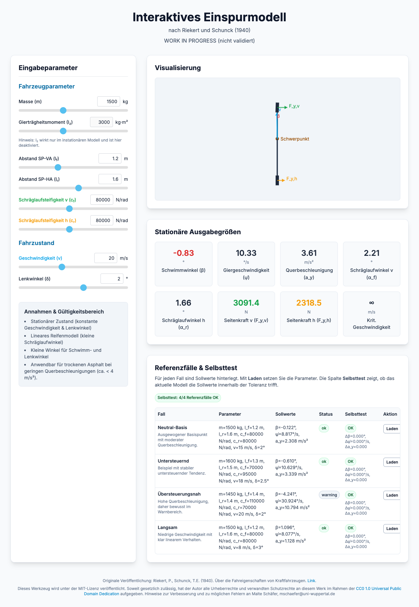

# bicycle_model

Interactive, browser-based bicycle model (stationary single-track / Einspurmodell) for learning, exploration, and reproducible validation.

## Model Screenshot



## Academic Context

This model was created as part of the course "Entwicklung automobiler Systeme" at Bergische Universität Wuppertal (Wintersemester 2025/26) by Malte Schäfer, a class for Maschinenbau master's students.

## Quick Links

- Get started: `GETTING_STARTED.md`
- Model background and equations: `docs/model/BACKGROUND.md`
- Validation details: `docs/model/VALIDATION.md`
- Example walkthrough: `examples/reference_case_walkthrough.md`
- Manual publish guide: `PUBLISHING.md`
- Main app: `model/bicycle_model.html`

## English

### What This Project Is

This repository provides a simple and explainable stationary bicycle model with:

- interactive parameter controls,
- safety-aware output states (`ok`, `warning`, `invalid`),
- shared reference cases,
- automated checks for model and UI behavior.

### Project Structure

- `model/bicycle_model.html`: interactive UI
- `model/bicycle_dynamics.js`: model equations and validation logic
- `model/reference_cases.js`: reference scenarios and expected values
- `scripts/run_checks.sh`: one-command quality gate
- `tests/*.test.js`: automated tests
- `docs/model/*`: model documentation and background

### Quick Start

1. Open the app:

```bash
open model/bicycle_model.html
```

On Linux/Windows, open the file manually in a browser.

2. Run checks:

```bash
./scripts/run_checks.sh
```

3. Run publish preflight (before pushing public):

```bash
./scripts/prepublish_check.sh
```

### Scope And Limits

- This is a stationary linear model (constant speed and steer angle).
- It is not a full transient vehicle dynamics simulator.
- Outputs outside intended assumptions are flagged by status/warnings.

### Contributing And Community

- Contribution guide: `CONTRIBUTING.md`
- Code of Conduct: `CODE_OF_CONDUCT.md`
- Security policy: `SECURITY.md`

### License

MIT (see `LICENSE`).

## Deutsch

### Was Dieses Projekt Ist

Dieses Repository bietet ein einfaches, nachvollziehbares stationäres Einspurmodell mit:

- interaktiven Parametern,
- sicherheitsorientierten Statuswerten (`ok`, `warning`, `invalid`),
- gemeinsamen Referenzfällen,
- automatisierten Prüfungen für Modell und UI.

### Akademischer Kontext

Dieses Modell wurde im Rahmen der Lehrveranstaltung "Entwicklung automobiler Systeme" an der Bergischen Universität Wuppertal (Wintersemester 2025/26) von Malte Schäfer erstellt, einer Veranstaltung für Master-Studierende im Maschinenbau.

### Schnellstart

1. Modell im Browser öffnen:

```bash
open model/bicycle_model.html
```

Unter Linux/Windows Datei direkt im Browser öffnen.

2. Prüfschleife ausführen:

```bash
./scripts/run_checks.sh
```

3. Publish-Preflight ausfuehren (vor oeffentlichem Push):

```bash
./scripts/prepublish_check.sh
```

### Modellgrenzen

- Stationäres lineares Modell (konstante Geschwindigkeit und Lenkwinkel).
- Kein vollständiger instationärer Fahrzeugdynamik-Simulator.
- Außerhalb des Gültigkeitsbereichs werden Ergebnisse klar markiert.
